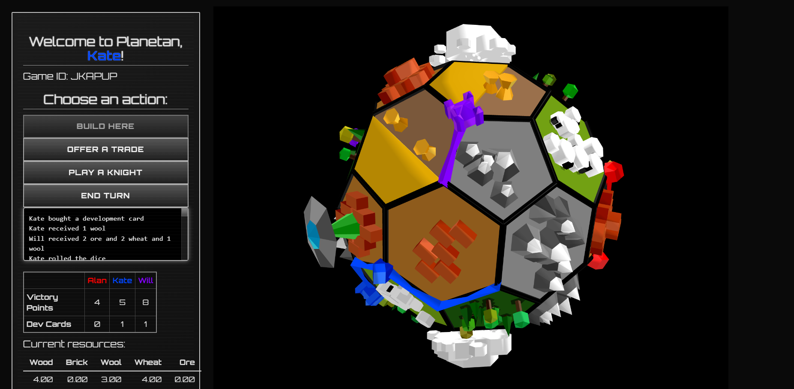
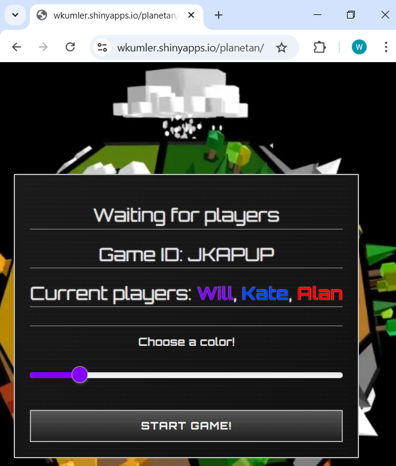

Welcome to [`planetan`](https://wkumler.shinyapps.io/planetan/)!
================

## Colonize an entire low-poly planet!

`planetan` is a game about colonization. Claim resources from the tiles
you’ve settled on to build new roads and settlements elsewhere on the
globe. Upgrade your settlements to cities with ore and wheat to double
your income from them!

## Online multiplayer competition

Team up with your friends anywhere in the world and challenge each other
to achieve 10 points first. Earn points by building settlements and
cities or by getting lucky when drawing development cards. Be careful
though - your competition may become your only way to trade for precious
resources!

## Synchronous and asynchronous gameplay

Not all online at the same time? Start a game whenever, send friends the
secret code, and log in whenever - your progress is saved automatically
and can be restarted whenever you’ve got time.

## Get started online at <https://wkumler.shinyapps.io/planetan/>

…at least until I run out of Shinyapps hours!
